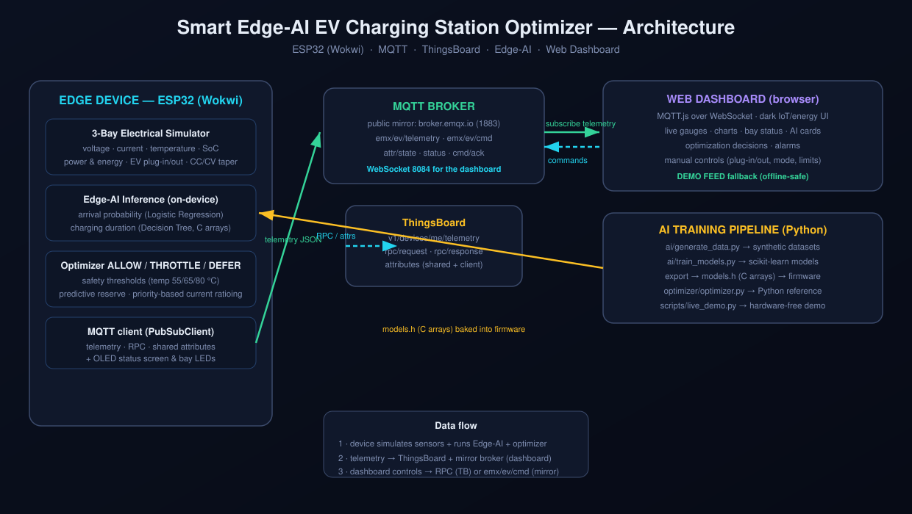

# Smart Edge-AI EV Charging Station Optimizer

A 3-bay EV charging station (ESP32 + Arduino, simulated in **Wokwi**) that uses
**Edge-AI** (scikit-learn models exported to C) to predict arrivals and charging
durations, and an **ALLOW / THROTTLE / DEFER** optimizer with hard safety
thresholds to manage feeder load. Telemetry streams over **MQTT** to
**ThingsBoard** and a public mirror broker that feeds a modern dark **web
dashboard**.



## Stack

- **Firmware** — ESP32 / Arduino C++ (Wokwi): 3-bay electrical + thermal
  simulator, on-device AI inference, optimizer, OLED + LED status.
- **Edge AI** — Python + scikit-learn: LogisticRegression (arrival probability)
  + DecisionTreeRegressor (charging duration) exported to C arrays in
  `firmware/smart_ev_charger/models.h`.
- **MQTT** — ThingsBoard device API (`v1/devices/me/...`) + mirror broker
  `broker.emqx.io` for the browser dashboard (works without ThingsBoard).
- **Dashboard** — `dashboard/index.html`: gauges, charts, bay cards, alarms,
  manual controls, with an offline DEMO FEED fallback (starts after ~12 s
  without MQTT data).

## Quick start (VS Code)

```bash
# 1. Python environment
python3 -m venv .venv
.venv/bin/pip install -r requirements.txt

# 2. Verify everything (14 automated checks)
.venv/bin/python scripts/run_tests.py

# 3. Full demo without hardware — publishes MQTT + prints console
.venv/bin/python scripts/live_demo.py

# 4. In another terminal, open the dashboard
.venv/bin/python dashboard/serve.py     # then http://localhost:8080
#    (or just double-click dashboard/index.html)
```

## Running the firmware in Wokwi (VS Code)

> ⚠️ Wokwi **does not compile** sketches — `wokwi.toml` loads a **prebuilt
> binary** (`build/smart_ev_charger.ino.elf`, included). Rebuild with
> arduino-cli after editing the firmware:

```bash
arduino-cli compile --fqbn esp32:esp32:esp32 \
  --output-dir firmware/smart_ev_charger/build firmware/smart_ev_charger
```

1. Open `firmware/smart_ev_charger` as the workspace root and press
   `F1 → Wokwi: Start Simulator` (Wokwi extension).
2. Watch the serial console (115200 baud), OLED and LEDs — then open the
   dashboard; the VS Code extension's IoT gateway gives the virtual ESP32
   real Internet access, so `emx/ev/*` MQTT flows to the dashboard (LIVE badge).
3. Optional: put your ThingsBoard device access token in `config.h`
   (`TB_ACCESS_TOKEN`) and rebuild for the official ThingsBoard uplink.

## AI pipeline

```bash
.venv/bin/python ai/generate_data.py     # synthetic datasets
.venv/bin/python ai/train_models.py      # train + export models.h + joblib
```

Arrival model: `LogisticRegression`, 6 time/busy features (ROC-AUC ≈ 0.79).
Duration model: `DecisionTreeRegressor` depth 8, 6 session features
(MAE ≈ 43 min, R² ≈ 0.91).

## Optimizer

Per tick, per bay, in order: hard safety → thermal ladder
(55 °C→75%, 65 °C→40%, 80 °C→DEFER) → predictive head-room reserve
(prob × free bays × 16 A) → proportional current ratioing with lowest-priority
deferral → hard limit `Σ I ≤ 64 A` (always enforced, even in MANUAL mode).

Safety thresholds are shared verbatim across `config.h`,
`optimizer/optimizer.py`, and `dashboard/js/demo.js`.

## Key topics (MQTT)

| Topic | Purpose |
|---|---|
| `v1/devices/me/telemetry` | ThingsBoard telemetry |
| `v1/devices/me/rpc/request/+` / `attributes` | ThingsBoard RPC + shared attrs |
| `emx/ev/telemetry` | dashboard telemetry (mirror broker) |
| `emx/ev/cmd` / `emx/ev/cmd/ack` | dashboard → device commands + ack |
| `emx/ev/attr/state` / `emx/ev/status` | config state + connectivity |

Commands: `plugIn, plugOut, setEnabled, setMode, setMaxCurrent, setBayLimit,
setPriority, setBusyRate, setAutoEvents, fault, clearFault, resetEnergy,
getStatus`

## Project layout

```
ai/          data generation, training, C export, Python inference
optimizer/   Python reference station + optimizer + telemetry schema
firmware/    ESP32 firmware + Wokwi files (smart_ev_charger/)
dashboard/   web dashboard (MQTT.js) + offline demo feed
scripts/     run_tests.py · live_demo.py · mqtt_probe.py
docs/        architecture diagram
handbook.md  full walkthrough + viva prep + step-by-step VS Code guide
```

## Testing

```bash
.venv/bin/python scripts/run_tests.py
# -> 14 passed, 0 failed
```

## Notes

- The demo clock runs ~60× real time (1 tick = 2 simulated minutes) so full
  sessions complete in seconds.
- Firmware keeps two MQTT connections on purpose: ThingsBoard + public mirror —
  the browser dashboard its WebSocket MQTT from the mirror, so the viva demo
  never dies if ThingsBoard is unavailable.