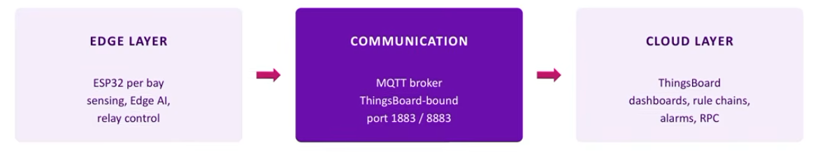

# Smart EV Charging Station Optimizer 

#### ESP32 | MQTT | ThingsBoard | Edge AI

- What are EV?
 Full form Electric vehicle, as the name suggests a smart vehicle which replaces the traditional petroleum based fuels.

- What are charging stations?
 An alternative of petrol pumps for electric vehicles.

- What are the things we are going to do through this internship ?
 In this session we are going to talk about the optimizations that are to be made in the charging stations. to make this more practical in terms of vehicles.

``The problem statement is like .If at a Power station there is a supply of 5kW and suppose 3Evs comes at 3 individual bays but the power demand is of 8kW.So how will we manage the throttling,load and we have to deliver optimization ,defferral,load management``

We are goin to stimulate a multibay EV charging station .Each bay measures its electrical parameters .The ESP32 sends this info to the cloud .Things boards monitors every bay predicts upcoming demands ,and decides how charging should be managed.

 # MQTT broker 
  Suppose it like a whatsapp for devices to communicate  between themselves. After uploading all the data to the cloud .We will train an AI model to manage all the load and electrical data and find an optimal path to serve customers.
  
# Technologies we will use

1. ESP32
2. Embedded C/C++
3. MQTT
4. Thingsboard
5. Cloud Dashboard
6. IoT
7. EdgeAI
8. Optimizations
9. Simulators like wokwi alternative for esp32

 # ThingsBord
It is the service we will use for cloud services. we will be using MQTT for sending the data to the cloud .

  # Data we will be sharing for the Station is 
  Load,Charging or idle ,probability of vehicle qty

# Edge AI
When the data is transferred from the device from the devices to the cloud and this causes latency but we will have to be ready for the device at instances .So This EDGE AI is a code on the device that allow the charging , manage throttle and adjust chargings in the abscense of the network
