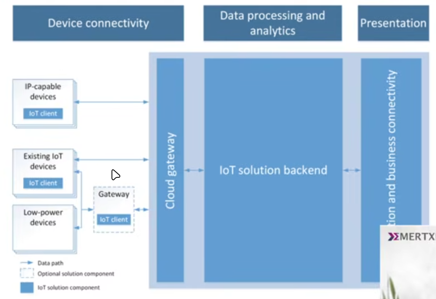
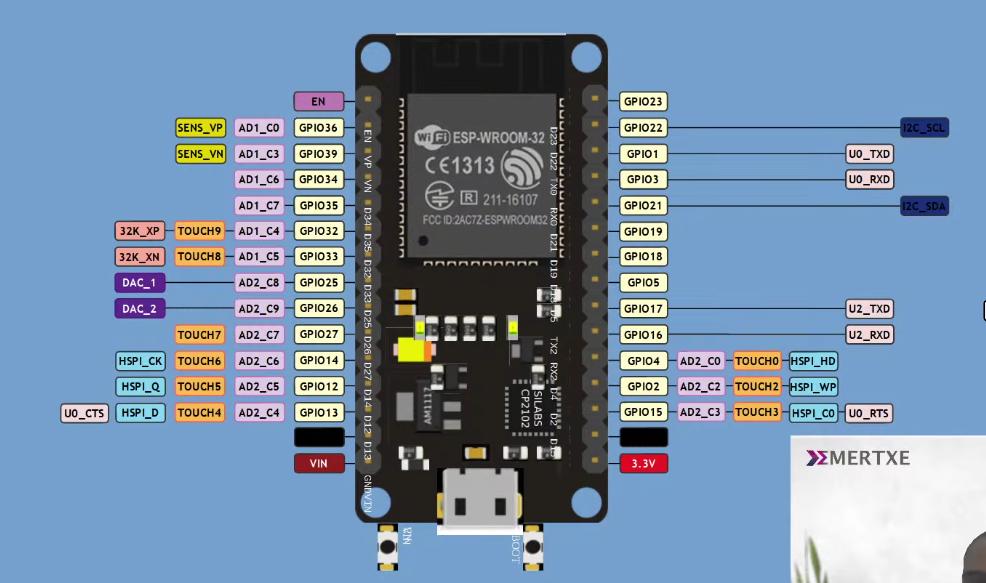

# what is Internet of things?
 A network of smart devices interconnected on a network.
 - Merging perspectives between devices,systems adn humans to build a better understanding of the world around us

# Architectuture 

# Arduino Functions
> as we know ESP32 is a arduino board and it works on arduino library .So ,First we are going to learn about basics like controling and managing light using 

- Interface -pinouts

# First program
: To blink a LED.

>First function
- pinMode()
    description : configure pin to act as input or output
    syntax: pinMode(pin,mode)

        GPIO pin : general purpose input output pin [either input peripherel switch or output led]
        
        switches : to know whether the device is plugged in or not 

        Relay : to alllow charging or throttle charging 

    > these are funcitonalities that we will have to attach to these GPIO pins to the board

- digitalWrite()
    description : write a high or a low value to a digital pin
    syntax: digitalWrite(pin,value)

- digitalread()
    description : Reads value from a secified digital pin.
    syntax: digitalread(value)

- dealy()
    description : Pauses the program for a amount of time (milisecond) specified as parameter.
    syntax: delay(ms)

syntax:
setup(){
// for one time execution
}

loop(){
//for repeated executions
}

Program1: WAP to blink LED

    1.Pin in/out
    2.Turn on LED
    3.Add delay
    4.Turn off
    5.Add delay
    6.repeat

    sample code:
    setup(){
        pinMode(2,OUTPUT)
            }
    loop(){digitalWrite(2,HIGH)
        delay(1000) //1 sec
        digitalWrite(2,LOW)
        delay(1000) //1 sec
        }

