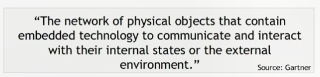

# what is Internet of things?
 A network of smart devices interconnected on a network.
 - Merging perspectives between devices,systems adn humans to build a better understanding of the world around us

# Architectuture 

# Arduino Functions
> as we know ESP32 is a arduino board and it works on arduino library .So ,First we are going to learn about basics like controling and managing light using 